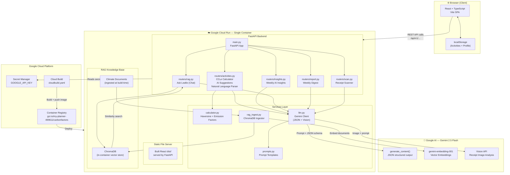
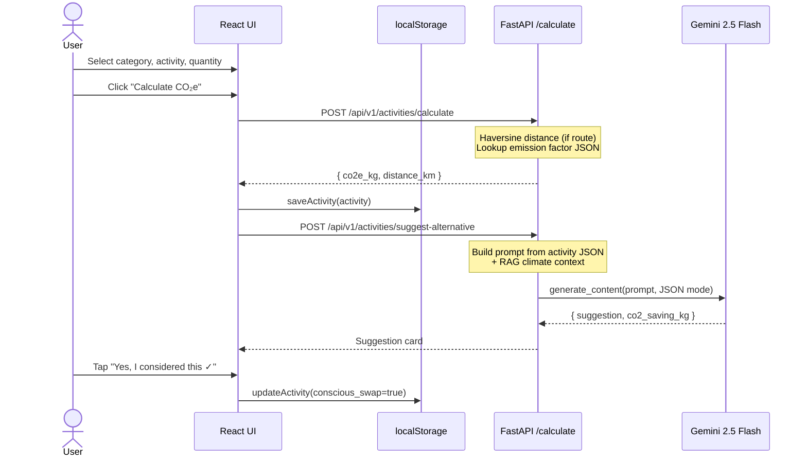
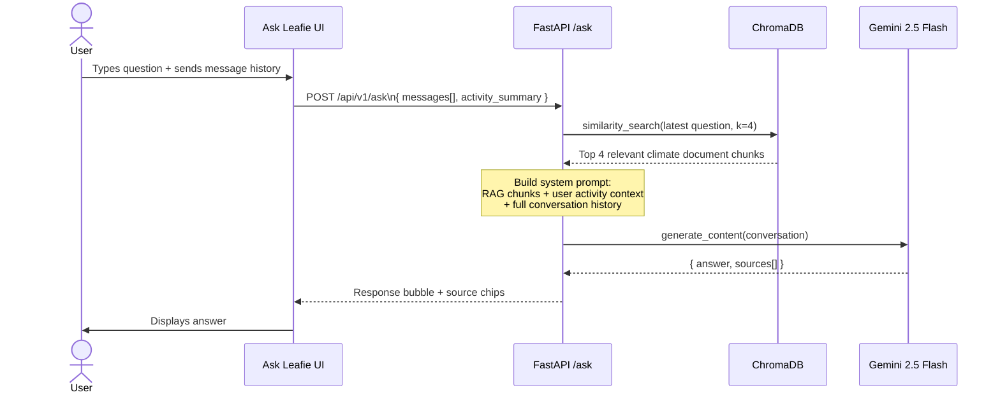
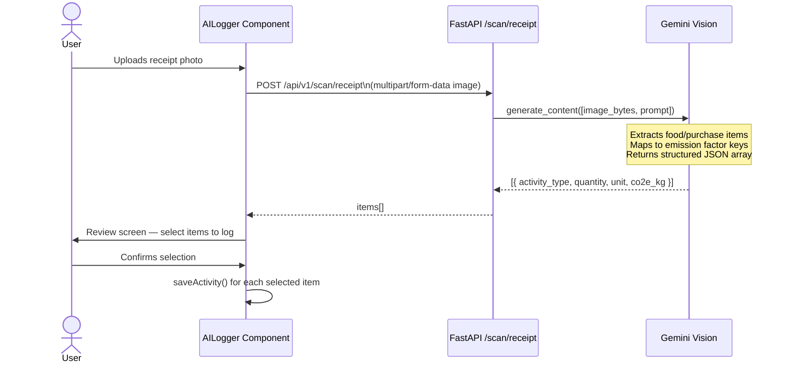
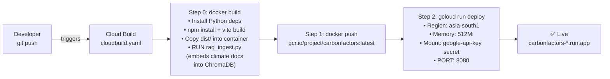

# CarbonFactors — System Architecture

> Full technical breakdown of the CarbonFactors system: components, data flows, deployment, AI pipeline, and design rationale.

---

## High-Level System Diagram



---

## Request Flow Diagrams

### 1. Manual Activity Logging



### 2. Ask Leafie (RAG Chat)



### 3. Receipt Scanner (AI Vision)



### 4. Cloud Build Deployment



---

## Component Map

### Frontend (`frontend/src/`)

| File | Purpose |
|---|---|
| `App.tsx` | Router, auth guard (redirect to `/onboarding` if no profile) |
| `pages/Dashboard.tsx` | Hero stat, donut chart, benchmark bars, recent activities, budget ring |
| `pages/LogActivity.tsx` | 6-step wizard — date + category → type → details → confirm → suggestion → done |
| `pages/Insights.tsx` | Tabbed: AI Insights + My Journey |
| `pages/Trends.tsx` | 6-month bar chart with category filter |
| `pages/AskClimate.tsx` | Conversational Ask Leafie UI with message history |
| `pages/Onboarding.tsx` | 3-step first-run wizard (country, transport, diet) |
| `components/AILogger.tsx` | AI shortcut panel: receipt scan + natural language entry |
| `components/BudgetRing.tsx` | Animated SVG ring for monthly CO₂ budget |
| `components/TopBar.tsx` | Header with live weekly CO₂ badge |
| `components/BottomNav.tsx` | 5-item nav: Home · Log · Insights · Trends · Ask Leafie |
| `lib/localStorage.ts` | All read/write helpers for activities + profile + timeframe |
| `lib/api.ts` | Typed fetch wrappers for all backend endpoints |

### Backend (`backend/`)

| File | Purpose |
|---|---|
| `main.py` | FastAPI app, CORS, router registration, SPA fallback |
| `config.py` | All env vars in one place — no secrets hardcoded |
| `emission_factors.json` | CO₂e kg per unit for every activity type |
| `cities.json` | Indian + global cities with lat/lon for haversine |
| `routers/activities.py` | `POST /calculate` · `POST /suggest-alternative` · `POST /parse-natural` |
| `routers/insights.py` | `POST /insights/generate` |
| `routers/rag.py` | `POST /ask` — RAG + conversation history |
| `routers/report.py` | `POST /report/weekly` |
| `routers/scan.py` | `POST /scan/receipt` — multipart image |
| `services/calculator.py` | Haversine formula + emission factor lookup |
| `services/llm.py` | `generate_json()` + `generate_json_with_image()` |
| `services/prompts.py` | All prompt templates — centralised, no logic |
| `services/rag_ingest.py` | Reads `rag/documents/`, chunks, embeds, stores in ChromaDB |

---

## Data Model

All user data lives in the **browser's `localStorage`** — the backend is completely stateless.

```typescript
// Activity — stored in localStorage
interface Activity {
  id: string;              // uuid v4
  date: string;            // "YYYY-MM-DD" (user-selected)
  category: string;        // "transport" | "energy" | "food" | "purchase"
  activity_type: string;   // e.g. "car_petrol", "food_biryani"
  origin?: string;         // for route-based transport
  destination?: string;
  distance_km?: number;    // computed by haversine
  quantity: number;
  unit: string;            // "km" | "kWh" | "kg" | "g" | "ml" | "item"
  co2e_kg: number;         // result from /calculate
  conscious_swap: boolean; // did user consider the suggestion?
  co2_avoided_kg?: number; // filled when conscious_swap = true
  created_at: string;      // ISO timestamp
}

// Profile — stored in localStorage
interface Profile {
  country: string;             // "IN" | "US" | "GB" | "EU"
  primary_transport: string;   // "car" | "public" | "cycle" | "walk"
  diet: string;                // "meat_heavy" | "mixed" | "vegetarian" | "vegan"
  monthly_budget_kg?: number;
}
```

---

## Design Decisions

These are the key architectural choices made during the hackathon build, and the reasoning behind them.

### Why `localStorage` instead of a database?

The primary goal was a working prototype in a short timeframe. Using `localStorage` eliminated the need for user authentication, database provisioning, and session management — all non-trivial to build and secure correctly. The trade-off is that data doesn't persist across devices, but for a single-user hackathon demo, this was the right call. A production version would replace this with a proper backend database (e.g. Firestore or PostgreSQL) and auth layer.

### Why a single Cloud Run container instead of separate frontend and backend services?

Keeping frontend and backend in one container meant one deployment pipeline, one `cloudbuild.yaml`, one service URL, and zero CORS complexity in production. FastAPI serves the built React `dist/` as static files and handles API routes under `/api/v1/`. For a hackathon, simplicity of deployment matters more than service isolation.

### Why ChromaDB in-container instead of a managed vector store?

ChromaDB running inside the container means zero external dependencies and the RAG knowledge base is always co-located with the API. The downside is that the vector index resets on every new deployment (it's rebuilt during Docker build time via `rag_ingest.py`). This is acceptable for a read-only knowledge base that doesn't change between deploys. A production system would use a persistent managed store (e.g. Vertex AI Vector Search or Pinecone).

### Why Gemini 2.5 Flash over other models?

The project ran on Google Cloud and was built for Promptwars, making Gemini the natural choice. Gemini 2.5 Flash offers a strong balance of speed and quality for structured JSON generation, has native multimodal support (used for receipt scanning), and has generous free-tier limits well-suited to a hackathon prototype. The `gemini-embedding-001` model handles RAG document embeddings.

### Why all prompts centralised in `prompts.py`?

Prompt engineering is iterative. Keeping all prompts in one file means they can be updated, versioned, and reviewed without touching business logic. Routers call prompt-builder functions from `prompts.py` and pass the results to `llm.py` — no prompt strings are scattered across the codebase.

---

## Security Notes

- **No user accounts / no server-side data** — all activity data stays in the user's browser
- **API key** stored in Google Secret Manager, injected at Cloud Run runtime
- **Prompt injection protection** — all user-supplied strings sanitised before LLM injection via `services/llm.py::sanitize()`
- **CORS** locked to the Cloud Run origin via `CORS_ORIGIN` env var
- **`.gitignore`** excludes `.env`, `__pycache__`, `.venv`, `rag/db/`

---

## Known Limitations & Future Work

This is a hackathon prototype. The following are known simplifications that a production version would address:

| Area | Current state | What a full build would do |
|---|---|---|
| **Food options** | Limited set of common Indian dishes and broad food categories | Comprehensive food database with regional variety, portion sizes, and preparation method factors |
| **Energy options** | Basic electricity and LPG entries | Grid-mix aware calculations per region, appliance-level tracking, renewable energy offsets |
| **Data persistence** | `localStorage` only — no cross-device sync | Authenticated user accounts with cloud-synced data |
| **Emission factors** | Estimated averages from public sources | Certified, regularly updated factors (e.g. DEFRA, EPA, IPCC) with source citations per entry |
| **RAG knowledge base** | Static documents ingested at build time | Regularly updated climate literature, user feedback loop |
| **Vector store** | In-container ChromaDB (resets on redeploy) | Persistent managed vector store |
| **Receipt scanning** | Works well for structured receipts; handwritten or complex layouts may fail | Improved vision prompting and fallback parsing |
| **Offline support** | None — AI features require network | Service worker caching for core features |
| **Multi-user / teams** | Not supported | Household or team carbon tracking with shared dashboards |
